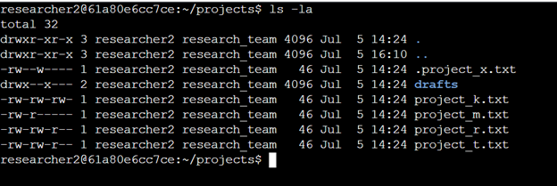
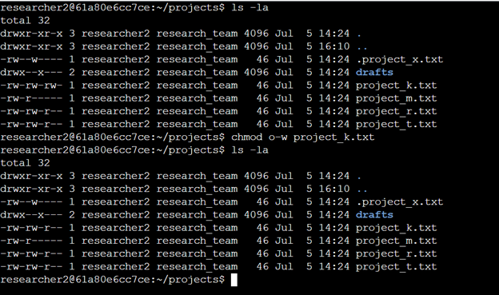
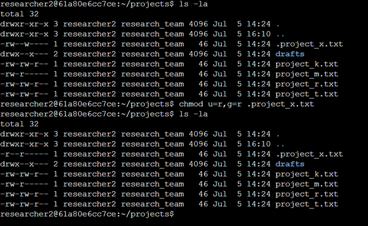
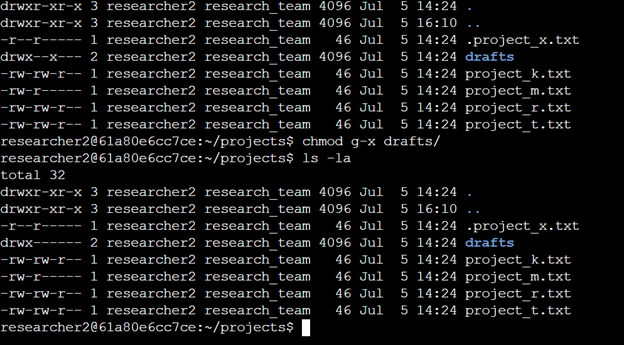

# File Permissions in Linux

## Project Description
You can accomplish nearly anything using Linux commands, including running apps, managing permissions, and managing/changing files. These processes can be chained together to easily perform complex tasks and batch tasks.

---

## Steps

### 1. **Check File and Directory Details**

  ```bash
  ls la
  ```

### 2. **Describe the Permissions String**
Looking at the `drafts` directory, we can see that there are 10 characters in the permissions string.

`drwx--x---`


- The first character indicates that this is a directory.
- Characters 2-4 (`rwx`) indicate that the user has read, write, and execute permissions.
- Characters 5-7 (`--x`) indicate that the group has execute permissions only.
- Characters 8-10 (`---`) indicate that other users have no permissions.


### 3. **Change File Permissions**


- The first command displays the contents of the directory, including hidden files and their permissions.
- The second command removes write permissions from other users for `project_k.txt`:
    ```bash
    chmod o-w project_k.txt
    ```
- The third command verifies that the changes were successful by displaying the updated permissions.


### 4. **Change File Permissions on a Hidden File**


- The first command displays the contents of the directory, including hidden files and their permissions.
- The second command sets the user and group permissions to read-only for `.project_x.txt`:
    ```bash
    chmod u=r,g=r .project_x.txt
    ```
- The third command verifies that the changes were successful by displaying the updated permissions.


### 5. **Change Directory Permissions**


- This command removes the execute permissions from the `drafts` directory, which was the only permission granted to anything other than the user:
    ```bash
    chmod o-x drafts/
    ```

---

## Summary
In this activity, I used bash to set permissions for files, hidden files, and directories based on the permissions that each required or was allowed. The user needs access to some things, while others shouldn’t have access to anything. In the case of the hidden file, it was archived and shouldn't be writable by anyone.
