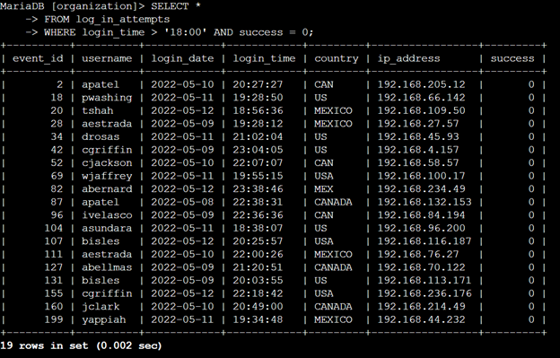
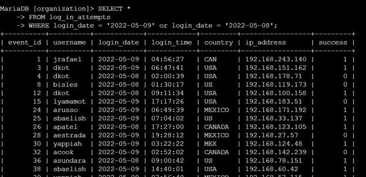
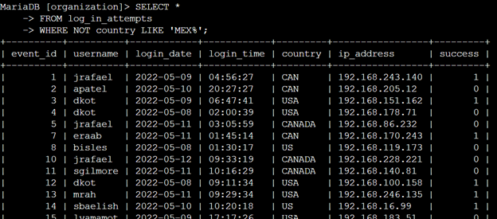
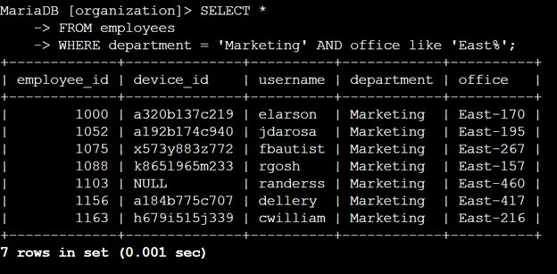
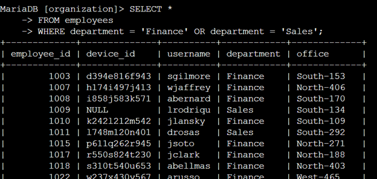
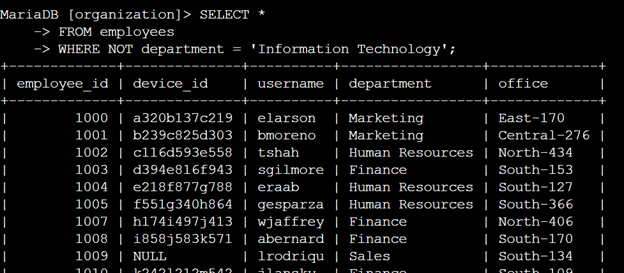

# Apply Filters to SQL Queries

## Project Description
You can use SQL queries to filter for specific information very precisely. SQL is powerful because you can customize the queries to include, exclude, compare, and contrast data.

---

## Steps

### 1. **Retrieve After Hours Failed Login Attempts**

This query selects all rows from all columns in the `log_in_attempts` table where the log-in time is after 6:00 PM and the attempt has failed.

---

### 2. **Retrieve Login Attempts on Specific Dates**

This query selects all entries from all columns in `log_in_attempts` that happened on `2022-05-08` or on `2022-05-09`.

---

### 3. **Retrieve Login Attempts Outside of Mexico**

This query selects all login attempts that come from outside of Mexico. The `LIKE` operator is used because some login attempts are listed as `MEX` while others are listed as `MEXICO`.

---

### 4. **Retrieve Employees in Marketing**

This query selects all data in the `employees` table where the department is Marketing and the office is in the East building. The `LIKE` operator is used because there are different office numbers in the East building.

---

### 5. **Retrieve Employees in Finance or Sales**

This query selects all data that matches either the Finance department or the Sales department.

---

### 6. **Retrieve All Employees Not in IT**

This query selects all data where the department is not `Information Technology`.

---

## Summary
SQL can be a powerful tool for searching databases. In this scenario, we used it to search for employees that matched certain criteria that we needed to filter by. In the real world, queries like this can help quickly find information that might take a long time for a human to locate manually.
